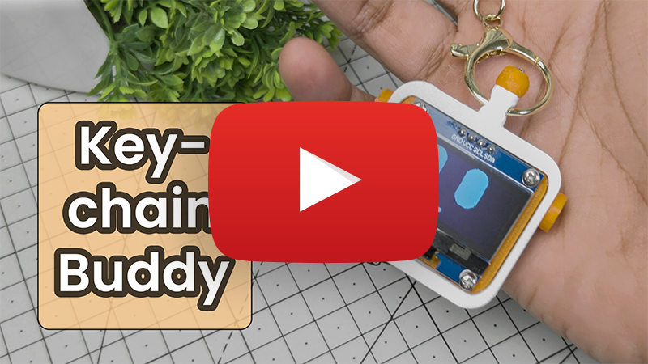

# Tiny OLED Keychain

[](https://ko-fi.com/techtalkies)   

A tiny animated OLED keychain built around a **Seeed Studio XIAO ESP32**.

DIY electronics keychains are everywhere right now, so I decided to build my own — complete with a tiny OLED face, multiple pixel-art expressions, and a custom 3D-printed enclosure.

The goal was to squeeze everything into the smallest and thinnest enclosure possible while still keeping the project simple enough to build.

[](https://ko-fi.com/techtalkies)
## Full build video
[](https://youtu.be/c_qwv6NKEDg)

## Features

- 1.3-inch 128×64 OLED display
- XIAO ESP32
- Animated pixel-art expressions
- Custom 3D-printed enclosure
- Rechargeable LiPo battery
- Physical power switch
- Compact keychain-sized design
- Simple I2C OLED interface

## Hardware

| Component | Description |
|---|---|
| XIAO ESP32 | Main microcontroller |
| 1.3" OLED | 128×64 I2C OLED display |
| LiPo Battery | Rechargeable battery |
| Slide Switch | Power control |
| 3D-printed enclosure | Custom-designed case |

## How It Works

The XIAO ESP32 controls the OLED display over I2C.

The OLED displays pixel-art expressions that can be changed or animated by the ESP32.

The battery is connected to the battery pads on the back of the XIAO ESP32, with a slide switch placed in series with the positive wire.

Everything is packed inside a custom 3D-printed enclosure designed specifically around the OLED PCB, XIAO, battery, and switch.

## OLED

The project uses a 1.3-inch 128×64 monochrome OLED.

The display is connected to the XIAO ESP32 using I2C.

Typical connections:

| OLED | XIAO ESP32 |
|---|---|
| VCC | 3.3V |
| GND | GND |
| SDA | D4|
| SCL | D5 |

Check your specific OLED module and XIAO pinout before wiring.

## 3D-Printed Enclosure

The enclosure was designed to be as small and thin as possible while accommodating the OLED's PCB.

Rather than hiding the OLED PCB completely, the design uses the PCB itself as part of the visible bezel around the display.

The enclosure also provides space for:

- XIAO ESP32
- LiPo battery
- Power switch
- OLED module
- Keychain attachment

STL files for the enclosure can be found in the `3D` folder.

## Software

The project was developed using the Arduino IDE.

### Libraries

Depending on the OLED module used, you may need:

- Adafruit GFX Library
- Adafruit SSD1306

Install the required libraries through the Arduino IDE Library Manager.

## Customizing the Expressions

The OLED face is made from simple monochrome pixel graphics, making it easy to create your own expressions.

You can add expressions such as:

- Happy
- Sad
- Angry
- Sleepy
- Surprised
- Wink
- Love
- Sunglasses

Because everything is rendered on the OLED, you can create completely different characters without changing the hardware.

## Project Structure

```text
Tiny-OLED-Keychain/
│
├── Code/
│   └── OLED_Keychain/
│       └── OLED_Keychain.ino
│
├── 3D/
│   ├── Top.stl
│   └── ...
│
└── README.md
```

## Build

1. Connect the OLED to the XIAO ESP32.
2. Connect the LiPo battery to the battery pads on the back of the XIAO.
3. Add the slide switch in series with the battery's positive connection.
4. Upload the firmware.
5. 3D print the enclosure.
6. Assemble the electronics inside the enclosure.
7. Attach a keyring or lanyard.
8. Turn it on and enjoy your tiny OLED companion.

## Ideas for Future Versions

Some ideas for expanding the project:

- Motion-controlled expressions
- IMU-based shake detection
- Bluetooth-controlled expressions
- More animated faces
- Custom user-uploaded faces
- Battery level indicator
- Different enclosure designs
- Cat, robot, ghost, or other character versions

## License

This project is provided for personal and educational use.

Check the repository files for the applicable license and terms for the firmware and 3D models.

---

Made by **Tech Talkies**

If you build your own version, I'd love to see it!
